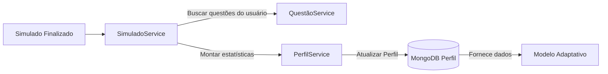

# 🧠 Microserviço de Perfil — BrainWin

Este serviço é responsável por **armazenar e atualizar o Perfil de Aprendizagem do usuário**, incluindo tópicos, subskills, structures e estatísticas de desempenho obtidas nos simulados.

O Perfil é usado pela IA para personalizar próximos simulados e evoluir o aprendizado do aluno.

---

## 🚀 Visão Geral

Este microserviço provê:

✅ CRUD do perfil por `user_id`  
✅ Atualização unificada de estatísticas após cada simulado  
✅ Suporte a adaptação baseada em tópicos e estruturas cognitivas  
✅ Dados agregados que orientam a evolução do aprendizado

📌 Cada aluno possui **apenas um perfil**.  
As atualizações sempre **preservam e expandem** todos os tópicos e subskills existentes.

---

## 🔄 Fluxo Geral da Solução



---

## 🏛️ Arquitetura da Solução

- Spring Boot 3.4
- MongoDB Atlas (Replica Set)
- JWT (Auth)
- API REST com validação por header `Authorization: Bearer <token>`
- Repository Pattern com Spring Data MongoDB

📌 Tipos de comunicação:
| Componente | Consome Usuário? | Para quê? |
|----------|:---:|-------------|
| Front-End | ❌ | Não Acessa o microserviço diretamente |
| MS Simulado | ✅ | Atualizar perfil do usuário |
| MS Usuário | ✅ | Salvar perfil base do usuárioa |
| MS Questões | ❌ | Apenas recebe user_id como referência |

---

---

## ⚙️ Instalação e Configuração

### ✅ Requisitos

- Java 21+
- Maven 3.9+
- Conexão com MongoDB (Atlas ou local)

### 🔌 Variáveis de Ambiente / `application.properties`

```properties
spring.data.mongodb.uri=${MONGO_URI}
spring.data.mongodb.database=brainwinTest

jwt.secret=${JWT_SECRET}
jwt.expiration-ms=86400000
```

### ▶️ Executando

```sh
mvn clean package
java -jar target/perfil-0.0.1-SNAPSHOT.jar
```

Servidor inicia em:  
📍 `http://localhost:8083`

---

## 📡 Principais Rotas

| Método | Rota | Autenticação | Descrição |
|--|--|--|--|
| GET | `/perfis/{user_id}` | ✅ | Buscar perfil do usuário |
| PUT | `/perfis/{user_id}` | ✅ | Atualizar perfil (merge adaptativo) |
| POST | `/perfis` | ✅ | Criar perfil inicial (apenas 1 por usuário) |
| DELETE | `/perfis/{user_id}` | ADMIN | Remover perfil (debug/admin) |

📝 Exemplo Perfil Base:

```json
{
  "user_id": "abc123",
  "topics": {
    "Matemática": {
      "structures": {
        "aritmetica": {
          "acertou": 12,
          "errou": 8
        }
      },
      "subskills": {
        "operações": {
          "acertou": 5,
          "errou": 3
        }
      }
    }
  }
}
```

---

## 🧱 Estrutura do Projeto

```plaintext
ai_startup_usuario/
│
├─ src/main/java/ai/startup/usuario
│  ├─ auth/
│  │  └─ JwtService.java
│  │
│  ├─ security/
│  │  └─ SecurityFilter.java
│  │
│  ├─ perfil/
│  │  ├─ PerfilController.java
│  │  ├─ PerfilService.java
│  │  ├─ PerfilRepository.java
│  │  ├─ Perfil.java
│  │  ├─ PerfilDTO.java
│  │  ├─ PerfilCreateDTO.java
│  │  └─ PerfilUpdateDTO.java
│  │  └─ StructureDTO.java
│  │  └─ SubskillDTO.java
│  │  └─ TopicDTO.java
│  │
│  └─ PerfilApplication.java
│
└─ pom.xml
```

---

## ✅ Status

| Recurso | Status |
|--------|:-----:|
| Criação do perfil ao registrar usuário | ✅ |
| Atualizar perfil via SimuladoService | ✅ |
| Preservar histórico completo | ✅ |
| Preparo para features de aprendizado adaptativo | ✅ |