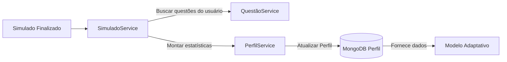

# 🧠 Microserviço de Perfil — BrainWin

Este serviço é responsável por **armazenar e atualizar o Perfil de Aprendizagem do usuário**, incluindo tópicos, subskills, structures e estatísticas de desempenho obtidas nos simulados.

O Perfil é usado pela IA para personalizar próximos simulados e evoluir o aprendizado do aluno.

---

## 🚀 Visão Geral

Este microserviço provê:

✅ CRUD do perfil por `user_id`  
✅ Atualização unificada de estatísticas após cada simulado  
✅ Suporte a adaptação baseada em tópicos e estruturas cognitivas  
✅ Dados agregados que orientam a evolução do aprendizado

📌 Cada aluno possui **apenas um perfil**.  
As atualizações sempre **preservam e expandem** todos os tópicos e subskills existentes.

---

## 🔄 Fluxo Geral da Solução



---

## 🏛️ Arquitetura da Solução

- Python 3.11
- FastAPI
- Motor de persistência: **MongoDB**
- Estratégia de merge hierárquico:
  - **Nunca remove subskills**
  - **Inclui novas ao surgir**
  - **Recalcula estatísticas globais**

📌 Comunicação com outros serviços:

| Serviço | Ação |
|--------|-----|
| Simulado | Atualiza Perfil após cada conclusão |
| Questões | Origem de resultados para cálculo do Perfil |
| Modelo adaptativo | Consumidor do Perfil para criar próximos simulados |

---

## ⚙️ Instalação e Configuração

### ✅ Requisitos

- Python 3.11+
- MongoDB em execução
- Gerenciador: `uvicorn`

### 🔧 Variáveis de ambiente

`.env` ou ambiente:

```
MONGO_URI=mongodb://localhost:27017
MONGO_DB=brainwinTest
MONGO_PROFILE_COLLECTION=perfil
```

### ▶️ Rodar localmente

```sh
pip install -r requirements.txt
uvicorn app:app --reload --port 8084
```

Servidor disponível em:  
📍 `http://localhost:8084`

---

## 📡 Principais Rotas

| Método | Rota | Autenticação | Descrição |
|--|--|--|--|
| GET | `/perfis/{user_id}` | ✅ | Buscar perfil do usuário |
| PUT | `/perfis/{user_id}` | ✅ | Atualizar perfil (merge adaptativo) |
| POST | `/perfis` | ✅ | Criar perfil inicial (apenas 1 por usuário) |
| DELETE | `/perfis/{user_id}` | ADMIN | Remover perfil (debug/admin) |

📝 Exemplo Perfil Base:

```json
{
  "user_id": "abc123",
  "topics": {
    "Matemática": {
      "structures": {
        "aritmetica": {
          "acertou": 12,
          "errou": 8
        }
      },
      "subskills": {
        "operações": {
          "acertou": 5,
          "errou": 3
        }
      }
    }
  }
}
```

---

## 🧱 Estrutura do Projeto

```plaintext
ai_startup_perfil/
│
├─ app/
│  ├─ perfil.py
│  ├─ perfil_model.py       # conversões e representações
│  ├─ perfil_service.py     # regras de merge e cálculo
│  ├─ mongo.py              # driver de conexão MongoDB
│  └─ config.py             # configurações
│
├─ requirements.txt
└─ README.md
```

---

## ✅ Status

| Recurso | Status |
|--------|:-----:|
| Criação do perfil ao registrar usuário | ✅ |
| Atualizar perfil via SimuladoService | ✅ |
| Preservar histórico completo | ✅ |
| Preparo para features de aprendizado adaptativo | ✅ |

---

## ✨ Observações Importantes

✅ O Perfil **sempre contém todas as skills possíveis**  
✅ Estatísticas agregadas são recalculadas a cada finalização  
✅ Nunca há “perda” de aprendizado do aluno  
✅ Designado para evoluir sem migração estrutural

---

📌 Próximas evoluções sugeridas:

- Reforço adaptativo para estruturas com maior dificuldade
- Histórico temporal de evolução por tópico
- Métricas contextualizadas por tentativa

---

Se precisar, posso também:
✅ Criar badges e logo no topo  
✅ Adicionar exemplos mais complexos de payload  
✅ Melhorar arte do fluxograma com cores e status

---

✉️ Suporte via: SimuladoService → PerfilClient  
🚀 BrainWin – uma plataforma que aprende com você! ✅
